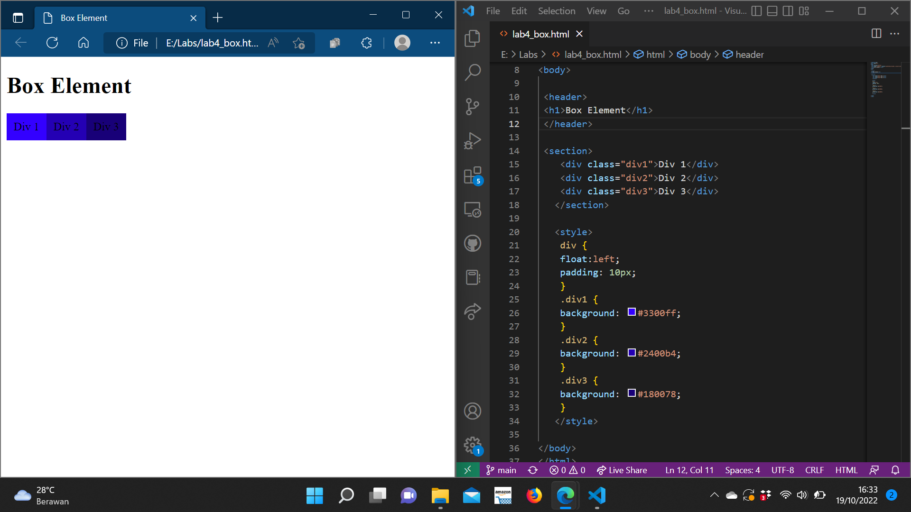
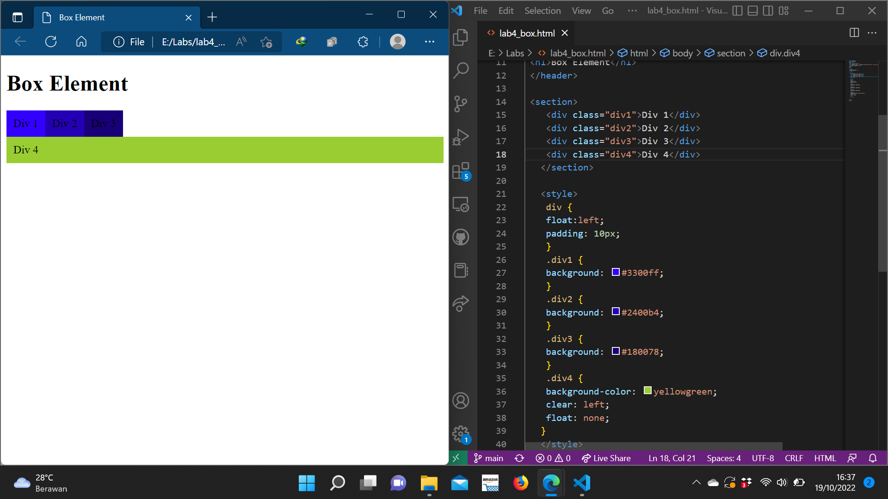
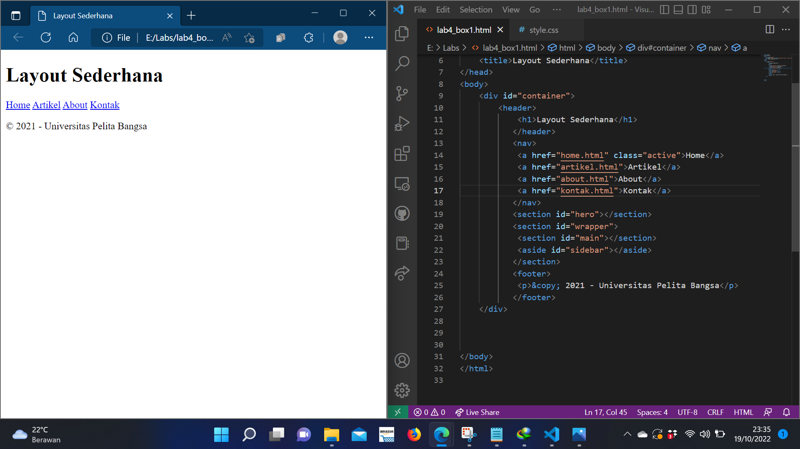
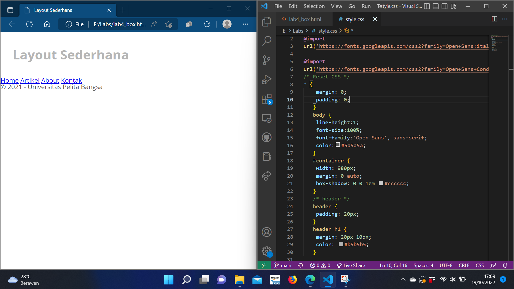
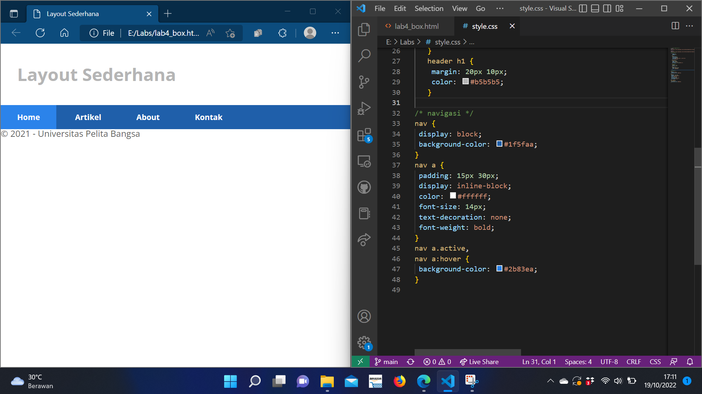
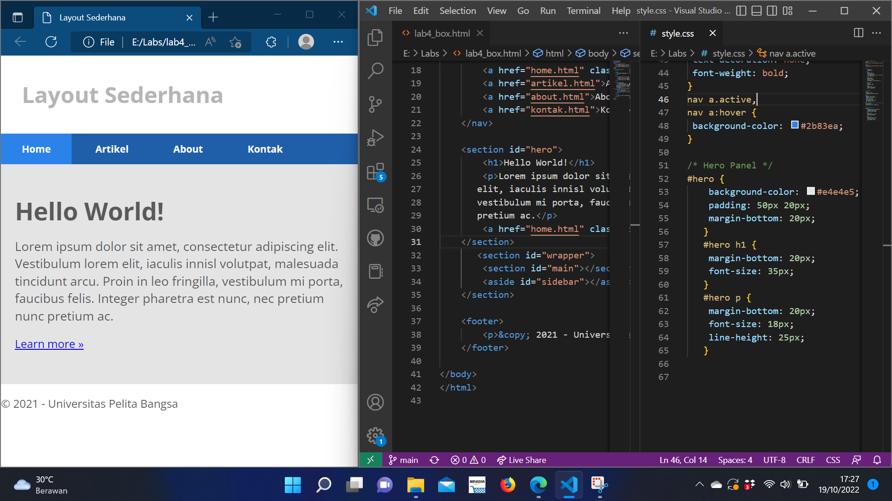
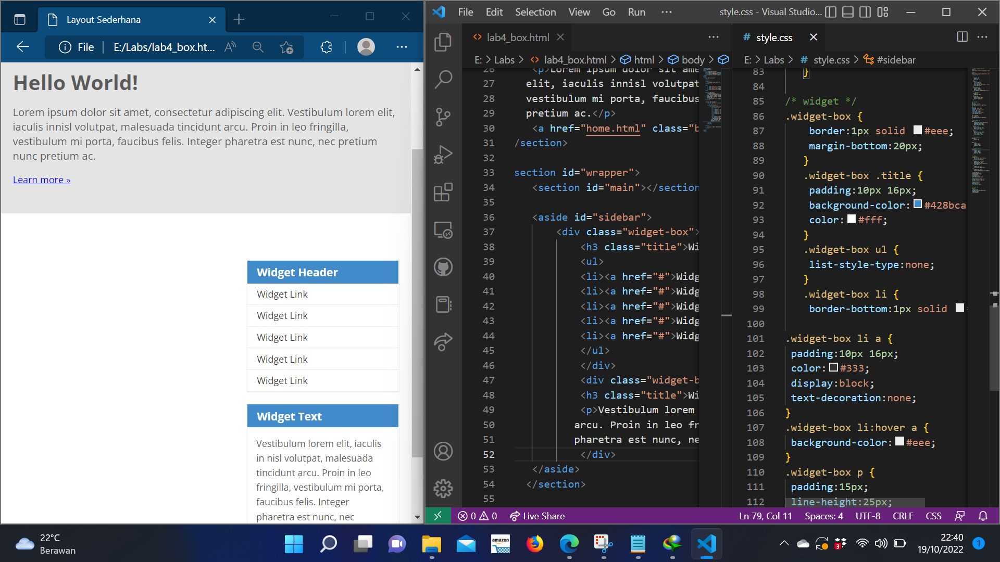
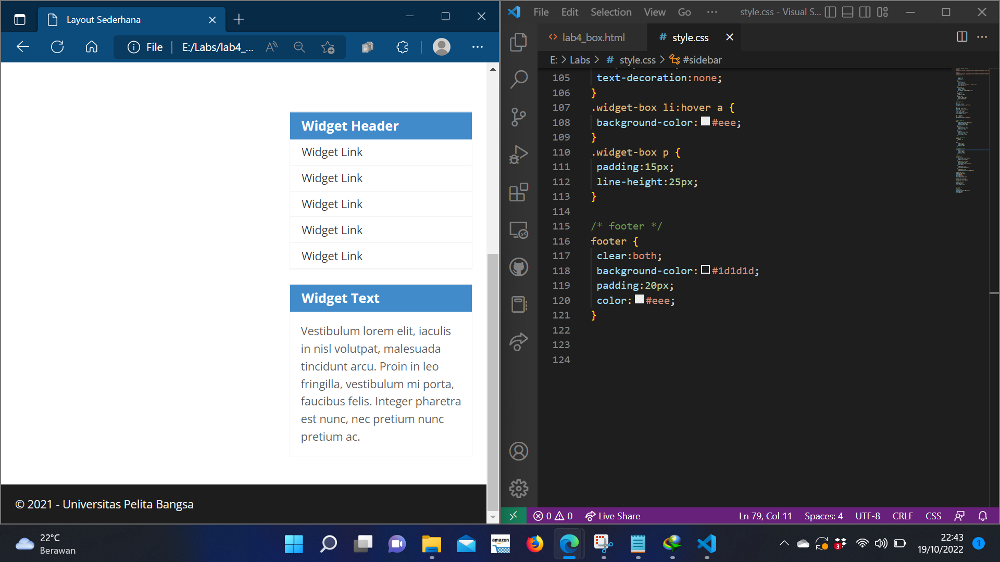
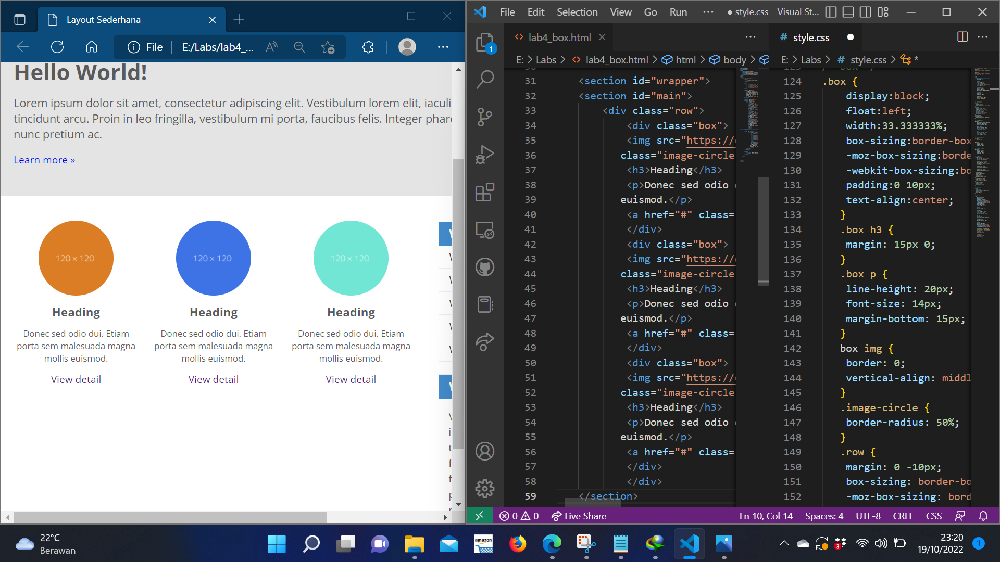
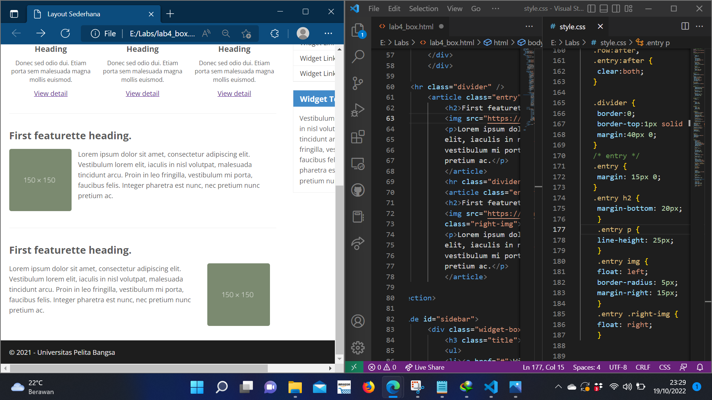

# Lab4Web

# Langkah-langkah Praktikum

# BOX ELEMENT

# 1. Membuat Box Element
Persiapan membuat dokumen HTML dengan nama file lab4_box.html seperti berikut. Kemudian tambahkan kode untuk membuat box element dengan tag div seperti berikut. Selanjutnya tambahkan deklarasi CSS pada head untuk membuat float element, seperti berikut.

# 2. Mengatur Clearfix Element
Clearfix digunakan untuk mengatur element setelah float element. Property clear digunakan untuk mengaturnya. Tambahkan element div lainnya seteleah div3 seperti berikut. Kemudian atur property clear pada CSS, seperti berikut.

# LAYOUT SEDERHANA

# 1. Membuat layout sederhana
Buat folder baru dengan nama lab4_layout, kemudian buatlah file baru didalamnya dengan nama home.html, dan file css dengan nama style.css.

# 2. Tambahkan CSS
Kemudian tambahkan kode CSS untuk membuat layoutnya.

# 3. Membuat Navigasi
Kemudian selanjutnya mengatur navigasi.

# 4. Membuat Hero Panel
Selanjutnya membuat hero panel. Tambahkan kode HTML dan CSS seperti berikut.

# 5. Mengatur Layout Main dan Sidebar
Selanjutnya mengatur main content dan sidebar, tambahkan CSS float. Kemudian selanjutnya menambahkan element lain dalam sidebar. Kemudian tambahkan CSS.

# 6. Mengatur Footer
Selanjutnya mengatur tampilan footer. Tambahkan CSS untuk footer.

# 7.Menambahkan Elemen lainnya pada Main Content
Tambahkan html berikut pada main content, Kemudian tambahkan CSS.

# 8. Menambahkan Content Artikel
Selanjutnya membuat content artikel. Tambahkan HTML berikut pada main content. Kemudian tambahkan CSS.

